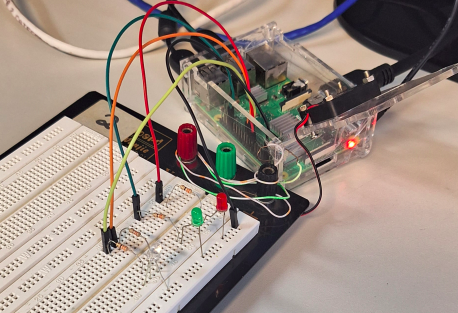

# Prática 5: Configuração do SystemD para Personalização de Serviços de Inicialização de S.O. em Linux Embarcado

Este repositório foi criado com o objetivo de hospedar os códigos da prática 5 da disciplina de Projetos em Sistemas Embarcados, nele constam um script bash, dois scripts python e dois servisos que quando instalados em systemmd, irão executar esses scripts.

# 1. Introdução

Essa prática tem como foco adicionar uma unidade de serviço personalizada para
gerenciar a inicialização e execução desse projeto em sistemas embarcados utiluizando Linux como sistema operacional. Essa
ação irá permitir a inicialização automática da aplicação quando da inicialização do sistema
operacional. Ao todo serão instalados e inicializados dois serviços, um serviço chamado de `blink.service`, que quando inicializado irá executar o script bash `blink.sh` com a função de acender e apagar um LED vermelho no pino 18 em intervalos de 0,2s, o outro srviço será o `prat5_led_pwm.service`, que quando inicializado irá executar um script python da entrega 3,`prat3_proj2_1.py`, o qual, no pino 12, inicializa um sinal de pwm em um LED verde. Por fim, quando o serviço `prat5_led_pwm.service` é parado é executado outro script python, `semaforo_on_stop.py`, que aciona um LED RGB de forma a se comportar como um semáforo. Quando os serviços executam um script python, é utilizado o interpretador do ambiente python `pyenv`, criando dentro do repositório com `venv`, esse ambiente já contem todas as bibliotecas para executar os scripts .Para documentar o projeto, foi escolhido o Git como o sistema de versionamento e o
GitHub como repositório, junto como o histórico de versionamento.

# 2. Projeto
## 2.1 Serviço blink.service

O arquivo `blink.service` é uma unidade de serviço para o systemd, o sistema de inicialização e gerenciamento do Linux. Esse arquivo define as configurações necessárias para criar e gerenciar um serviço chamado de `Blink LED`, onde o objetivo é executar o script bash `blink.sh`.
A configuração do serviço é dividida em três seções principais: `[Unit]`, `[Service]` e `[Install]`. Na seção `[Unit]`, é fornecida uma descrição resumida do serviço através da linha `Description= Blink LED`. Além disso, a diretiva `After=multi-user.target` indica que o serviço será inicializado apenas após o sistema atingir o nível de execução multiusuário, um estado operacional comum em servidores ou sistemas sem interface gráfica.
A seção `[Service]` define o comportamento do serviço propriamente dito. A diretiva `ExecStart=/home/sel/SEL0337---Projetos-em-Sistemas-Embarcados-Pratica-5/blink.sh` especifica o comando ou script que será executado para iniciar o serviço. Nesse caso, o script em questão está localizado no diretório `/home/sel/SEL0337---Projetos-em-Sistemas-Embarcados-Pratica-5/`. Adicionalmente, a linha `user=sel` define que o serviço será executado com os privilégios do usuário sel, limitando o acesso do processo a permissões desse usuário.
Por fim, na seção `[Install]`, a diretiva `WantedBy=multi-user.target` vincula o serviço ao alvo `multi-user.target`, permitindo que ele seja habilitado para inicialização automática sempre que o sistema atingir esse estado operacional.

Para utilizar esse serviço, é necessário copiá-lo para o diretório `/lib/systemd/system/`.

```
sudo cp blink.service /lib/systemd/system/
```

Em seguida, é nescessário habilitá-lo para execução automática. 

```
sudo systemctl enable blink.service
```

A execução imediata pode ser feita com `sudo systemctl start blink.service`.

```
sudo systemctl start blink.service`
```
## 2.2 Código blink.sh

O script `blink.sh` é um programa escrito em Bash que realiza o controle de um LED verde no pino GPIO 18 na Raspberry Pi. A finalidade do script é alternar o estado do pino GPIO 18, fazendo com que um LED conectado a ele pisque continuamente.

Na primeira etapa, o script configura o pino 18, permitindo que o sistema operacional o disponibilize o pino 18 para controle.

```
echo 18 > /sys/class/gpio/export 
```
Em seguida, o script define o pino 18 como uma saídaecho. Isso indica que o pino será usado para enviar sinais elétricos, para ligar ou desligar o LED.

```
out > /sys/class/gpio/gpio18/direction
```

Após a configuração inicial, o script entra em um loop infinito com a estrutura `while [ 1 ]`, que executará as ações repetidamente até que o processo seja manualmente encerrado. Dentro do loop, o pino GPIO é controlado, sendo ligado e desligado. Isso é feito escrevendo os valores 1 e 0 no arquivo `/sys/class/gpio/gpio18/value`. 

```
echo 1 > /sys/class/gpio/gpio18/value
```
```
echo 0 > /sys/class/gpio/gpio18/value
```

Quando o valor 1 é enviado, o pino é ativado, e o LED acende. Após um intervalo de 0,2 segundos, controlado pelo comando `sleep 0.2s`, o valor 0 é enviado, apagando o LED.

## 2.3 Serviço prat5_led_pwm.service

O serviço `prat5_led_pwm.service` é criado e funciona quase que da mesma forma que o script `blink.service`, porém com algumas diferenças nas diretivas `ExecStart` e `ExecStop`.

A diretiva `ExecStart` especifica o comando a ser executado para iniciar o serviço. Nesse caso, o comando utiliza um ambiente virtual python, chamado de pyenv, para executar o script `prat3_proj2_1.py`, localizado dentro do repositório. Esse script Python é o responsável pela implementação do controle PWM do LED verde no pino 12, que pode variar seu brilho de acordo com os parâmetros configurados.

```
ExecStart=/home/sel/SEL0337---Projetos-em-Sistemas-Embarcados-Pratica-5/pyenv/bin/python3 /home/sel/SEL0337---Projetos-em-Sistemas-Embarcados-Pratica-5/prat3_proj2_1.py
```


Complementarmente, a diretiva ExecStop define o comando executado quando o serviço é interrompido. Nesse cenário, outro script python, chamado `semaforo_on_stop.py`, é inicializado, executando o conrole de um LED RGB como se fosse um semáforo.

```
ExecStop=/home/sel/SEL0337---Projetos-em-Sistemas-Embarcados-Pratica-5/pyenv/bin/python3 /home/sel/SEL0337---Projetos-em-Sistemas-Embarcados-Pratica-5/semaforo_on_stop.py
```

Além disso, a linha `user=sel` determina que o serviço será executado com as permissões do usuário sel, limitando o acesso e aumentando a segurança do sistema.

## 2.4 Código prat3_proj2_1.py

O código utiliza a biblioteca RPi.GPIO para controlar os pinos GPIO de um Raspberry Pi, configurando o pino 12 para gerar um sinal PWM. O script começa com a importação das bibliotecas necessárias. A biblioteca RPi.GPIO e a biblioteca time.

O programa é encapsulado em um bloco principal `(if __name__ == '__main__')`, o que é uma prática recomendada em Python para garantir que o código seja executado apenas quando o arquivo for chamado diretamente e não importado como módulo. Dentro desse bloco, a lógica principal é estruturada dentro de um bloco `try`. Essa abordagem é usada para gerenciar interrupções ou erros durante a execução, garantindo que as configurações dos pinos GPIO sejam sempre limpas antes do término do programa.

Na configuração inicial, o script define o modo de numeração dos pinos como BCM. Em seguida, o pino GPIO 12 é selecionado como o responsável por gerar o sinal PWM. O PWM é configurado no pino 12 com uma frequência de 5 Hz, o que significa que o ciclo de ligado e desligado do sinal ocorrerá cinco vezes por segundo. O PWM é então iniciado com um duty cycle de 0%. Posteriormente, o duty cycle é ajustado para 50%, fazendo com que o sinal fique ligado metade do tempo e desligado na outra metade.

```
GPIO.setmode(GPIO.BCM) #configurando o modo do gpio
	
pwm_pin  = 12 #definindo pino de pwm

pwm = GPIO.PWM(pwm_pin , 5) #configuando o pwm no pino 12 com 5Hz
pwm.start (0) #inicializando pwm com duty cycle 0


pwm.ChangeDutyCycle(50) #configurando o duty cycle para 50%
```

Para evitar que o programa seja encerrado imediatamente após configurar o PWM, um loop infinito é implementado. Esse loop mantém o script em execução, com uma pausa de 1 segundo entre cada iteração para reduzir o consumo de recursos do processador.

O bloco except é utilizado para capturar uma interrupção do teclado, como `Ctrl+C`, permitindo que o programa seja encerrado de forma controlada e exiba a mensagem `"Processo interrompido."`. Finalmente, no bloco finally, o comando `GPIO.cleanup()` é executado. 

## 2.5 Código semaforo_on_stop.py

O código é uma aplicação prática para controlar um sistema de semáforo utilizando um Raspberry Pi eu LED RGB conectado aos pinos 9,10 e 11, para controlar os LEDs, vermelho, verde e azul, respectivamente. Ele faz uso da biblioteca RPi.GPIO, e da biblioteca time.

O programa começa com a definição dos pinos GPIO aos quais os LEDs serão conectados.
```
red_pin=9 #define o pino do led vermelho
green_pin=10 #define o pino do led verde
blue_pin=11 #define o pino do led azul
```

Em seguida, o modo de numeração dos pinos GPIO é configurado como BCM,em seguida, o comando GPIO.setup(pin, GPIO.OUT) é utilizado para configurar cad um dos pinos como saída.

```
GPIO.setup(red_pin , GPIO.OUT) #configurando o pino do led vermelho como saida
GPIO.setup(green_pin , GPIO.OUT) #configurando o pino do led verde como saida
GPIO.setup(blue_pin , GPIO.OUT) #configurando o pino do led azul como saida
```

Após isso, os LEDs são inicializados como LOW e programa entra em um loop infinito que simula o ciclo de um semáforo tradicional. Dentro do loop, o código alterna entre as três cores do semáforo.
Para a luz vermelha o LED vermelho é aceso com `GPIO.HIGH`, enquanto os LEDs verde e azul são apagados com `GPIO.LOW`. O programa aguarda por 1 segundo antes de passar para a próxima fase que é a luz amarela.
Para a luz amarela o LED verde é aceso, sem desligar o LED vermelho, criando uma transição visual para o próximo estado do semáforo.O intervalo de tempo também é de 1 segundo.
Na última fase, que é a luz verde, o LED vermelho é apagado, e o LED verde permanece aceso, indicando que os veículos têm permissão para seguir. O programa então aguarda 1 segundo antes de reiniciar o ciclo.
O loop continua executando indefinidamente, mantendo a simulação do semáforo em operação até que o programa seja interrompido manualmente.

O código também implementa um tratamento de exceções através do bloco `try-except`. Isso permite que, se o programa for interrompido manualmente, ele capture a exceção `KeyboardInterrupt` e exiba a mensagem "Processo interrompido.".
Além disso, no bloco finally, o comando GPIO.cleanup() é utilizado para limpar a configuração dos pinos GPIO.

## 2.2 Montagem do circuito para testar os programas

Por fim, foi feita a montagem para a realização dos testes. Na figura 1, é possível visualizar o circuito funcionando com os serviços e scripts desenvolvidos.

<p align="center">
<br>
<em><b>Figura 1:</b> Montagem e teste do circuito para testar os código juntamente com os serviços na Raspberry Pi.</em>

</p>


